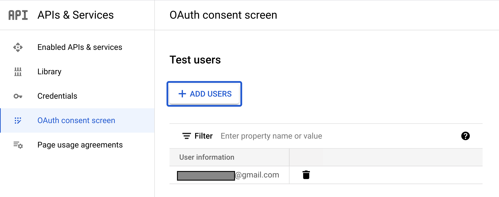
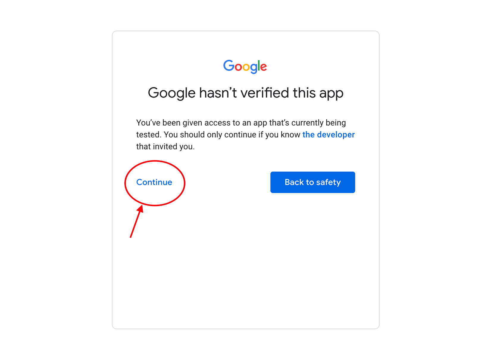
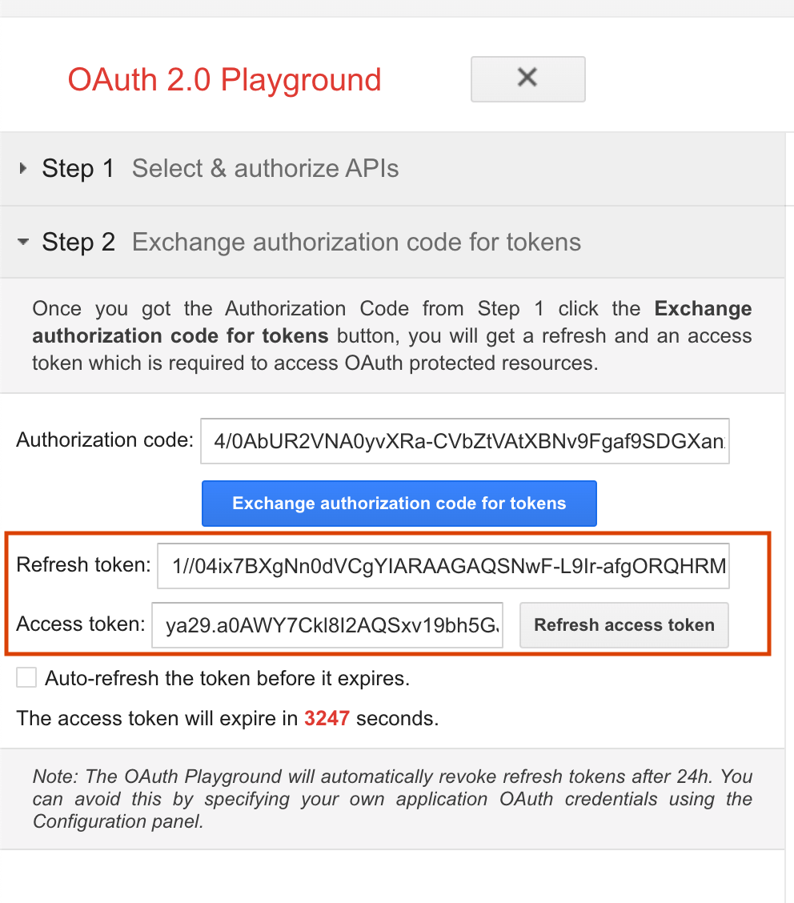

# Creating OAuth2 App in Google Console

1. Go to [Google Console](https://console.developers.google.com/)

2. Configure Test Users:

Add your user to Test Users to allow them you login to the app.

3. When login you will get this message: "Google hasn’t verified this app"

This is normal because we are using a test account. Just click on "Continue" and accept permissions.

4. On the Playground click on "Exchange authorization code for tokens" to get the access token and refresh token, and copy them to your `.env` file.

